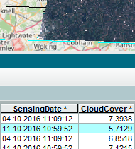



## Purpose
The purpose is to provide assistance to occasional users to deal with Sentinel data in a local ArcGIS Desktop environment by means of two Python Toolbox tools and common ArcGIS Desktop experience:

1. **Search** Data Hub Services' (DHuS) product catalog for Sentinel-2 products (L1C, or L2A soon) according to given criteria (in particular spatiotemporal constraints and cloud cover limit).  
  The search results are stored in a local product catalog (raster catalog) acting as a controllable cache (for product metadata and previews).  
  
2. Interactively browse metadata (attribute table) and product previews (by selecting product records); mark desired product records for download.
3. For each _Marked_ entry in the local product catalog, **Download** the respective raster data package.  
  

Upon download success, the respective raster datasets are displayed in ArcMap.

#### Characteristics
* :construction: Level-2A (L2A) products, available from ESA's Copernicus Open Access Hub ([SciHub DHuS](https://scihub.copernicus.eu/dhus)) since begin of May 2017, will be respected _soon_ (please stay tuned here).  
  The _Download_ tool will then display a L2A product by a Group Layer, composed of confidence images for cloud (CLD) and snow/ice (SNW), a natural color composite (TCI), and a scene classification image (SCL), along with appropriate symbology:  
  
* Proxy server settings are automatically taken into account by the python interpreter, either based on respective Internet Explorer settings, or based on the two environment variables `https_proxy` + `http_proxy` (incl. optional Basic Authorization, see the proxy-example*.* files within the [doc](doc) directory).
* CODE-DE support (since March 2017): The [German mirror site provides DHuS](https://code-de.org/dhus) similary to SciHub. The Toolbox tools do now allow for choosing CODE-DE as an alternative DHuS site (in addition to the mainstream DHuS at SciHub site).  
  📓 **Note**: It may happen that certain data sets are missing at CODE-DE site. If in doubt, rerun the respective tool against the reference DHuS at SciHub site.
* The newer version (>=14) of the Products Specification Document (PSD) is respected, but ArcMap does not yet support it in terms of a built-in raster product (:construction: presumably upcoming ArcGIS 10.5.1 will support it, so please stay tuned here). As a substitute for this, the natural color composite (TCI) is used for the _Download_ tool output parameter until further notice.
* A multi-tile package is represented by multiple records in the search results table (raster catalog) rather than by one single product record. This way each tile preview can be examined individually. When it comes to downloading such a multi-tile product, the _Download_ tool treats those multiple records as a single entity, i.e. a single (full) product download will be performed regardless of how many tiles are _Marked_.  
   Over time, this kind of quirk loses its relevance because newer products (those provided since the end of September 2016) are provided solely as single-tile packages.
* Contrary to the previous point: When using the "Image selection" mode of the _Download_ tool, the download of product images is performed with _Marked_ tiles only, i.e. non-marked tiles are actually ignored even if they are part of a multi-tile package.

## Prerequisites
* Valid login credentials for DHuS at either one of the following
    * SciHub site: https://scihub.copernicus.eu/dhus/#/self-registration
    * CODE-DE site: https://code-de.org/dhus/#/self-registration
* Tested with ArcMap/ArcCatalog version 10.4.1 and 10.5 (not suitable for ArcGIS Pro until further notice).
* Regarding ArcMap 10.4.1:
  * [ArcGIS 10.4.1 Raster Patch](http://support.esri.com/Products/Desktop/arcgis-desktop/arcmap/10-4-1#downloads?id=7396).
  * On affected systems: [ArcGIS Runtime Error R6034 Patch](http://support.esri.com/download/7391).

## Getting Started
* [Download ZIP](../../archive/master.zip) and extract its content to a local directory that can be reached by an ArcCatalog _Folder Connection_.  
  Make sure that the original file structure is preserved (relative paths); all referenced files have to be properly placed with respect to the main Toolbox files (.pyt, \*.xml), by name sensub.py and all \*.lyr files within their respective subdirectory.  
  📓 **Note**: Do not simply drag and drop the Toolbox icon to a desired ArcCatalog _Folder Connection_ (e.g. "My Toolboxes"), because by doing so ArcCatalog copies only the Toolbox .pyt file in conjunction with its belonging *.xml help files but leaves out all other dependent files!
* Before using the tools, it is highly advised to read the respective _Item Description_ of the Toolbox and of each tool in advance (see respective context menu in ArcMap), particularly the _Usage_ of each tool (also reachable from each _Tool Help_). Amongst others, the _Usage_ of the _Search_ tool introductorily explains some general ArcMap settings that have to be carried out in advance.  
  When running the parameter form of a particular tool, consult the respective _Parameter Explanation_ shown in the side panel (button "Show Help >>" opens the side panel).
